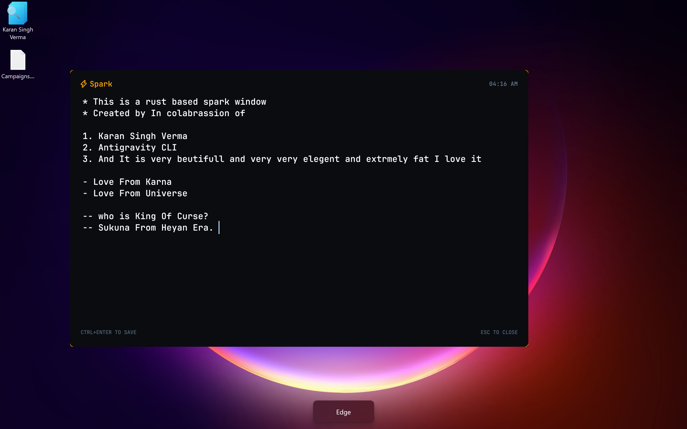
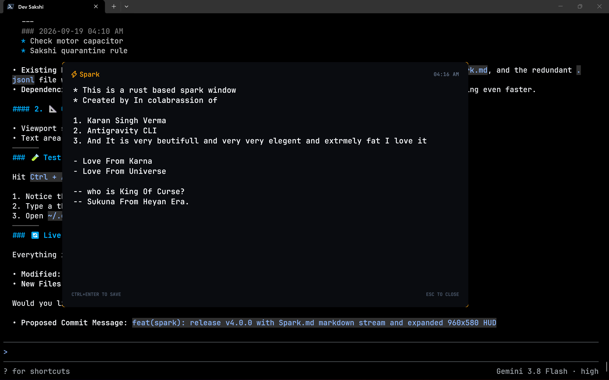

# ⚡ Spark

> **Module**: `Modules/Spark`  
> **Ecosystem**: Sakshi (साक्षी // The Witness)  
> **Role**: Hardware-Accelerated Ephemeral Thought Capture HUD  
> **Binary**: `~/.local/bin/Spark.exe`  
> **Global Shortcut**: `Ctrl + Alt + S` (Native Windows Explorer, 0 MB Idle RAM)  
> **Storage Sink**: `~/.gemini/Spark.md`  

<p align="center">
  <b>Sub-10ms Native Rust Thought Capture HUD for Windows 11</b><br>
  <i>Native Rust (LLVM) • Zero Background Daemons • 0 MB Idle RAM • Void Black (#0A0C10) • Smart List Engine</i>
</p>

<p align="center">
  
  
  
  
  
  
</p>

---

## 📸 Visual Showcase

### 1. Ephemeral Capture HUD (Desktop View)
*Clean Void Black (`#0A0C10`) card with dynamic amber border glow, auto-focus, and smart bullet formatting.*
<p align="center">
  
</p>

### 2. Live Flowstate Capture (Terminal Overlay)
*Summoned instantly via `Ctrl+Alt+S` over active development windows without breaking focus.*
<p align="center">
  
</p>

---

## 🌟 Overview & Philosophy

**Spark (साक्षी // Spark)** is a sovereign, zero-friction ephemeral thought capture HUD engineered for Windows 11. It eliminates the cognitive friction of context switching when sudden ideas, strikes, or intuitions arise during deep flow.

Existing tools fail the "Capture Paradox":
- **Obsidian**: Superb synthesis engine, but too slow for 2-second fleeting capture.
- **Windows Sticky Notes**: Bloated UWP app with telemetry and heavy memory footprint.
- **Notepad / CLI**: Requires window management, file naming, and manual saving.

Spark adheres strictly to Sakshi's **Zero-Daemon Invariant**:
- **0 MB Idle RAM / 0% CPU**: No persistent background daemon loop or tray icon. Spark exists **strictly while typing**.
- **Sub-10ms Cold Launch**: Compiled with native Rust LLVM into a standalone single-file binary (~3.1 MB) that hits the screen instantaneously.
- **Spacious Void HUD Canvas**: Expansive `960x580` viewport, centered on active display, borderless Void Black (`#0A0C10`), dynamic amber border glow.
- **Single-Instance Sovereign Teleportation**: Win32 Mutex guarantees only one instance exists. If summoned from another virtual desktop, teleports the window to the current workspace and focuses instantly.
- **Default Bullet Onset**: Pre-loaded with `* ` bullet; cursor blinking at index 2 ready to type instantly.
- **Inactivity Auto-Destruct Watchdog**: If left idle for >10s, displays a real-time countdown beside `ESC TO CLOSE`. If idle exceeds 60s, automatically closes without saving. Any keypress immediately cancels the timer.
- **Strict Save Invariant**: Only commits on `Ctrl+Enter` with actual content. Closing via `Esc`, timer, or empty bullet never pollutes storage.
- **Atomic Append-Only Stream**: Writes directly to `~/.gemini/Spark.md` upon `Ctrl+Enter` and terminates completely.

---

## 📐 Keyboard Shortcuts & Ergonomics

| Keybinding | Action | Behavior |
| :--- | :--- | :--- |
| **`Ctrl + Alt + S`** | **Summon Spark** | Instant sub-10ms cold launch anywhere across Windows. |
| **`Ctrl + Enter`** | **Commit & Vanish** | Appends note to `~/.gemini/spark.jsonl`, closes window, 0 MB residue. |
| **`Esc`** | **Dismiss / Cancel** | Closes window immediately without saving. |
| **`Enter`** (on `- text`) | **Smart Bullet** | Automatically inserts `- ` on next line. |
| **`Enter`** (on `1. text`)| **Smart Number** | Automatically inserts `2. ` on next line. |
| **`Enter`** (on empty) | **Exit List** | Clears the bullet/number prefix and reverts to clean text. |

---

## 🗄️ Storage Schema (`~/.gemini/Spark.md`)

Each capture is appended as a clean, human- and machine-readable Markdown block:

```markdown
---
### 2026-09-19 04:10 AM
* Check 3-phase motor winding capacitor ratings
* Sakshi quarantine rule
```

This clean Markdown stream eliminates the ~40-token JSON overhead per entry (an 85% token reduction), renders natively in Obsidian, VS Code, or Notepad, and enables effortless ingestion during session boot scans.

---

## 🚀 Installation & Deployment

### 1. Build and Install
Run the automated installation script from PowerShell:

```powershell
.\Modules\Spark\Install-Spark.ps1
```

This will:
1. Compile the optimized release binary with Link-Time Optimization (LTO) and symbol stripping (`strip = true`).
2. Deploy the binary to `~/.local/bin/Spark.exe`.
3. Register the native Windows Explorer shortcut (`Spark.lnk`) bound to **`Ctrl + Alt + S`** with 0 MB idle RAM.
4. Verify user `%PATH%`.

### 2. Uninstall
To cleanly teardown the module:

```powershell
.\Modules\Spark\Uninstall-Spark.ps1
```

---

## 🏛️ Engineering Invariants

1. **Zero Daemon**: 0 MB idle RAM, 0% CPU. Windows Explorer handles the global shortcut hook.
2. **Standalone Binary**: Zero external runtime dependencies, 100% self-contained native PE binary in `~/.local/bin/Spark.exe`.
3. **Typography**: Native Nerd Font auto-detection (`JetBrainsMonoNLNerdFont`, `Meslo`, `Cascadia Code`) with smooth fallback.
4. **Pristine Cleanup**: Intermediate compilation artifacts (`target/`) are excluded from version control.
